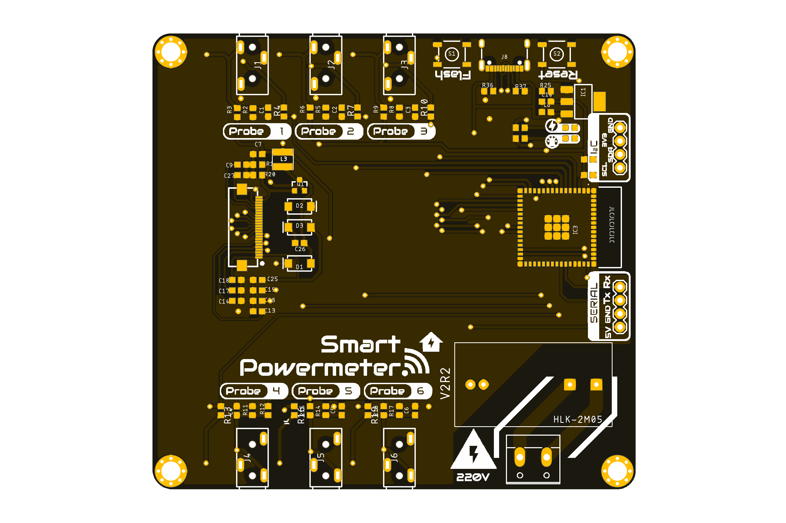
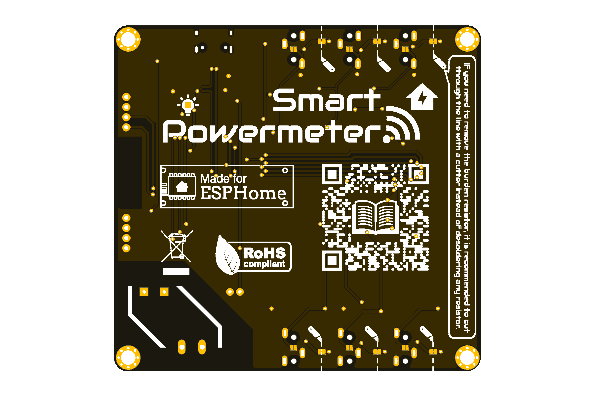

[![Documentation Status][documentation-shield]][documentation]
[![GitHub Release][releases-shield]][releases]
[![License][license-shield]](LICENSE)

[![Project Maintenance][maintenance-shield]][maintenance]
[![buyit][buyit-shield]][buymecoffee]

# Smart Powermeter
The Smart Powermeter is powered by a ESP32-S2, allowing the measurement up to 6 CT clamps for reading electric current and real-time display on an 2.9" e-paper display.

   
      

## Project tree

<li><a href="./Design/">Design</a></li>
<li><a href="./Documentation/">Documentation</a></li>

<li><a href="./README.md">README.md</a></li>

[documentation-shield]: https://readthedocs.org/projects/smart-powermeter/badge/?version=v2r1&style=for-the-badge
[documentation]: https://smart-powermeter.readthedocs.io/en/latest/

[releases-shield]: https://img.shields.io/github/release/JGAguado/Smart_Powermeter.svg?style=for-the-badge
[releases]: https://github.com/JGAguado/Smart_Powermeter/releases

[license-shield]: https://img.shields.io/badge/License-CC%20BY--NC--SA%204.0-lightgrey.svg?style=for-the-badge

[maintenance-shield]: https://img.shields.io/badge/maintainer-J.%20G.%20Aguado-blue.svg?style=for-the-badge
[maintenance]: https://github.com/JGAguado

[buyit-shield]: https://img.shields.io/badge/buy%20it%20on-elecrow-blue.svg?style=for-the-badge
[buyit]: https://www.elecrow.com/smart-powermeter.html
