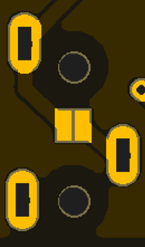

🏗️ Assembly
============================

Soldering 
----------
.. Important::
    Please note that some components in this board need to be soldered.

The |Product| comes as a set consisting on a :term:`SMD` pre-soldered board to which you will need to mount the following components:

* `HLK-2M05 <https://www.hlktech.com/en/Goods-39.html>`_ power module, a 2W AC-DC step-down switching power supply module :term:`THT` solderable.
* A 2-Pin 2mm-pitch screw terminal block, for the AC power imput, also :term:`THT` solderable.

.. Note:: 
  When buying the |Product| read the product description to make sure these two components are included, otherwise you might need to get them on your
  own.

The soldering of these two components is quite fast, just make sure not to bend any of the power supply module pins. If you have never soldered or you want to improve your soldering techniques I recommend you 
the `Adafruit Guide To Excellent Soldering <https://learn.adafruit.com/adafruit-guide-excellent-soldering>`_

.. _jumpers:

Jumpers
------------
In order to make easier the enabling/disabling of certain functions, some jumper pads have been integrated. Despite their state can be reconfigured, by cutting the trace in between or applying some solder wire in between, the default setting is the recommended one. 

There are three different kind of jumpers, all of them mounted on the bottom surface of the board:

1. Power LED: This jumper is **disabled** by default, so the Power LED indicator will not show any light. For enabling it, carefully apply some solder wire to both pads assuring a connection between them. If you regret it later, just desolder it with care and clean the surface afterwards.

2. RRS: This jumper is **disabled** by default, so the middle ring of the Jack connector is not connected to the tip. For enabling it, carefully apply some solder wire to both pads assuring a connection between them. If you regret it later, just desolder it with care and clean the surface afterwards.

3. Burden resistor. This jumper is **enabled** by default, so the burden resistor is active in the circuit. For disabling it, use a thin cutter to section the trace route between the two pads of the jumper. If you regret it later, just solder it back with care.

.. Note:: 
  For cutting the trace route of a jumper it's better to **apply less pressure** with the cutter in the beggining **and repeat** the operation several times rather than apply brute force just once.

Assembly
--------
Once the board is fully soldered, it's time to mount the e-paper display (in case you are using this accessory to display real-time information):

1. Open the clamp connector, by smoothly pulling up the tab.
2. Introduce the e-paper :term:`FPC` with the exposed pads facing down (against the PCB)
3. Close the clamp connector
4. Bend carefully the e-paper's :term:`FPC` in a way that the panel rests over the PCB. Add a very small piece of double-side tape on the rear to fix it.

Last but not least, it is highly recommended to mount the |Product| on an enclosure (like the suggested :ref:`enclosure`) to prevent unintended contacts between the bottom 
side of the board (since the high-voltage pins are exposed).
