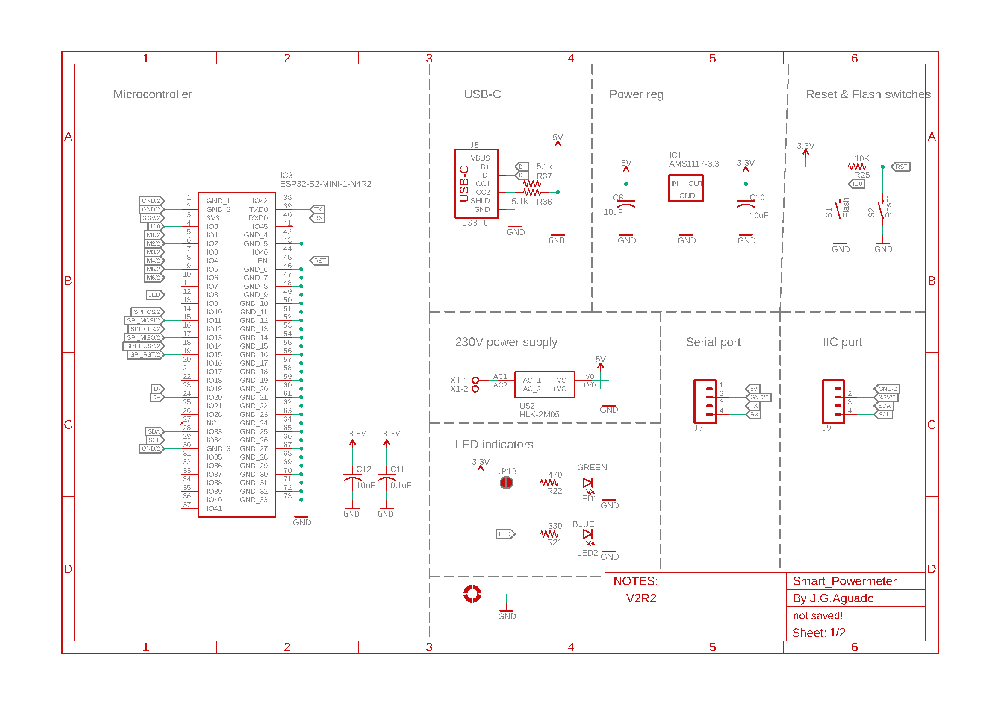

📐 Design
===========================

Electronic schematics
---------------------

.. image:: ../../Documentation/Schematics/Schematic_2.png
    :width: 49%

:download:`Download PDF <../../Documentation/Schematics/Schematic.pdf>`

.. _pcb:

:term:`PCB`
----------

.. raw:: html

    <iframe src="_static/ibom.html" height="800px" width="100%"></iframe>

Enclosure drawings
------------------

.. image:: images/assembly/enclosure.png
    :width: 100%

:download:`Download PDF <../../Enclosure/LK-PLC01.pdf>`

Technical Specifications
------------------------

Microcontroller 
^^^^^^^^^^^^
.. list-table:: 
    :widths: 50 80
    :stub-columns: 1

    * - Module
      - ESP32-S2-MINI-1
    * - SoC
      - Xtensa® singlecore 32-bit LX7 up to 240MHz
    * - Flash
      - 4MB
    * - PSRAM
      - 2MB

Power
^^^^^^^^^^^^

.. list-table:: 
    :widths: 50 80
    :stub-columns: 1

    * - Input (AC) 
      - 100-240VAC | 50-60Hz
    * - Input (USB)
      - 5V @ 500mA

Features
^^^^^^^^^^^^

.. list-table:: 
    :widths: 50 80
    :stub-columns: 1

    * - Interface 
      - USB Type C 
    * - 
      - 2.4GHz WiFi 
    * - 
      - UART
    * - 
      - :term:`IIC` (:math:`I^2C`)
    * - Display
      - 2.9" e-paper 
    * - Sensors
      - 6x SCT-013-000 series CT-clamps

Dimensions
^^^^^^^^^^^^

.. list-table:: 
    :widths: 50 80
    :stub-columns: 1

    * - Size 
      - 92x87x20mm
    * - 
      - 115x90x40mm (with  enclosure)
    * - Weight
      - 60g
    * - 
      - 130g (with enclosure)

Environment
^^^^^^^^^^^^

.. list-table:: 
    :widths: 50 20 20 20 20 20
    :header-rows: 1
    :stub-columns: 1

    * - Parameter
      - Symbol
      - Min.
      - Typ.
      - Max.
      - Unit
    * - Working temperature [1]_
      - :math:`T_{amb}`
      - 0
      - 25 
      - 60
      - *°C*
    * - Storage temperature [1]_
      - :math:`T_{amb}`
      - 0
      - 25 
      - 60
      - *°C*

.. [1] Based on components datasheets.

