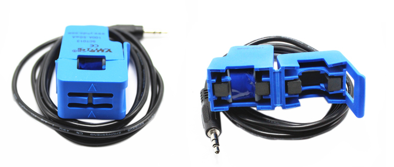
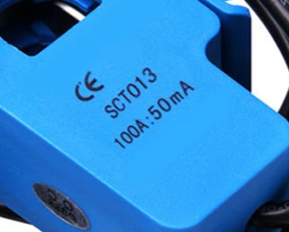
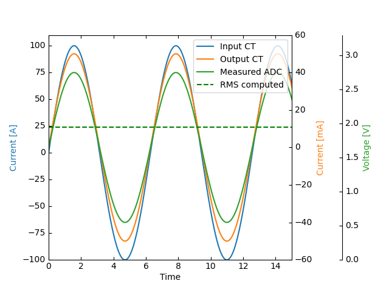
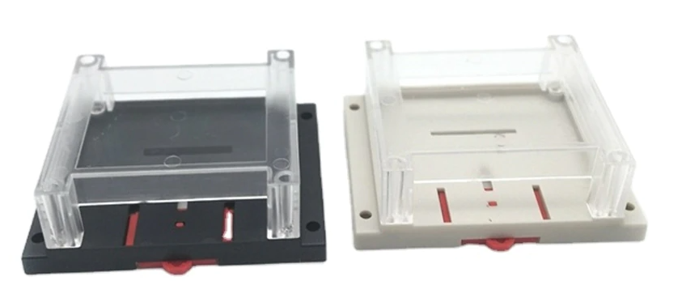

💡 Details
===============

Power
--------
The |Product| can be powered in two ways: through the USB-C (only for programming and testing purposes) **or** through the AC Input, but not simultaneously. 

AC Power
^^^^^^^^^^^^^
The `HLK-2M05 <https://www.hlktech.com/en/Goods-39.html>`_ module is a 2W AC-DC step-down 
switching power supply module, ready to receive 100-220V AC and deliver 5V DC that later on is reduced to 3.3V through an LDO (for the ESP32 module).

The board is designed to be powered directly through the screw terminal block. Before plugging the wires in, make sure they have no power.

Input
-----------
The |Product| supports up to 6 independent *analog inputs* ready to read CT clamps (or probes):

.. _pinout:

.. list-table:: Pinout table
    :widths: 10 20
    :header-rows: 1

    * - GPIO
      - Name
    * - 01
      - Probe 0
    * - 02
      - Probe 1
    * - 03
      - Probe 2
    * - 04
      - Probe 3
    * - 05
      - Probe 4
    * - 06
      - Probe 5

Regarding the kind of CT-clamps, I recommend the SCT-013 series, comming in a wide number of ranges and with a 3.5 jack connector:

.. list-table:: 
    :widths: 50 50
    :header-rows: 1

    * - Model
      - Ratio
    * - SCT-013-000
      - 100A:50mA
    * - SCT-013-005
      - 5A:1V
    * - SCT-013-010
      - 10A:1V
    * - SCT-013-015
      - 15A:1V
    * - SCT-013-020
      - 20A:1V
    * - SCT-013-025
      - 25A:1V
    * - SCT-013-030
      - 30A:1V
    * - SCT-013-050
      - 50A:1V
    * - SCT-013-060
      - 6A:1V
    * - SCT-013-000V
      - 100A:1V

When selecting a CT clamp, it is crucial to consider the anticipated measurement range. This ensures accurate measurements and prevents 
exceeding the ESP32's maximum reading range.

.. Note:: 
  The default CT clamp in the set is the SCT-013-000, which has the highest range in the series. However, for measurements below 3A, it may not provide the desired level of quality.

Each channel incorporates a simple internal circuit that adjusts the induced voltage from the CT clamp (proportional to the measured current) 
to prepare the signal for reading by the :term:`ADC` of the microcontroller. For more details on the circuit, refer to this 
`guide <https://docs.openenergymonitor.org/electricity-monitoring/ct-sensors/interface-with-arduino.html>`_.

In general, except for the SCT-013-000, the induced voltage can be read by the conditioning circuit mentioned earlier. 
However, if the CT clamp output is also a current, a burden resistor is necessary. The |Product| includes a **22 Ohm** resistor for 
convenience, making it easier to desolder if not needed, as explained in the :ref:`desoldering` section.

Communications
-----------
In addition to the analog input mentioned before, there is also a direct connection to:

:term:`IIC` (:math:`I^2C`) bus:
^^^^^^^^
This port is not accessible from external pins, but internally connected to a BMP280 sensor that can offer info about 
environmental temperature & pressure:

:SDA: *GPIO33*
:SCL: *GPIO34*

Serial bus:
^^^^^^^^^^^
:Tx: *TXD0*
:Rx: *RXD0*

.. _enclosure:

Enclosure
---------
The |Product| has been designed to fit in the electronics enclosure LK-PLC01,
compatible with DIN rails and screws, and it is recommended for indoors only.

:External size: 115x90x40mm
:Material: ABS Plastic
:Color: Transparent cover, black or beige base