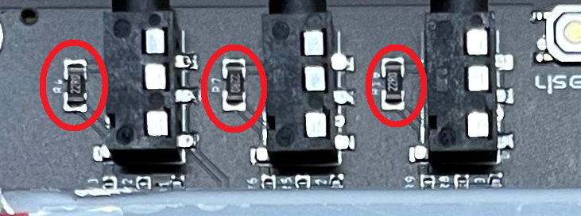

💡 Details
===============

Soldering 
----------
.. Important::
    Please note that some components in this board need to be soldered.

The |Product| comes as a set consisting on a :term:`SMD` pre-soldered board to which you will need to mount the following components:

* `HLK-2M05 <https://www.hlktech.com/en/Goods-39.html>`_ power module, a 2W AC-DC step-down switching power supply module :term:`THT` solderable.
* A 2-Pin 2mm-pitch screw terminal block, for the AC power imput, also :term:`THT` solderable.

.. Note:: 
  When buying the |Product| read the product description to make sure these two components are included, otherwise you might need to get them on your
  own.

The soldering of these two components is quite fast, just make sure not to bend any of the power supply module pins. If you have never soldered or you want to improve your soldering techniques I recommend you 
the `Adafruit Guide To Excellent Soldering <https://learn.adafruit.com/adafruit-guide-excellent-soldering>`_

Powering
--------
The |Product| can be powered in two ways: through the USB-C (only for programming and testing purposes) **or** through the AC Input, but not simultaneously. 

AC Power
^^^^^^^^^^^^^
The `HLK-2M05 <https://www.hlktech.com/en/Goods-39.html>`_ module is a 2W AC-DC step-down 
switching power supply module, ready to receive 100-220V AC and deliver 5V DC that later on is reduced to 3.3V through an LDO (for the ESP32 module).

The board is designed to be powered directly through the screw terminal block. Before plugging the wires in, make sure they have no power.

.. Danger::
    The installation of the Smart Powermeter should only be carried by people with **good knowledge about high-voltage electric installations** 
    and familiarized with the procedure that involves installing ct-clamps around main voltages.

.. Danger::
    If your are using the AC power **never touch the board while is powered**. 

Input
-----------
The |Product| supports up to 6 independent *analog inputs* ready to read CT clamps (or probes):

.. _pinout:

.. list-table:: Pinout table
    :widths: 10 20
    :header-rows: 1

    * - GPIO
      - Name
    * - 01
      - Probe 0
    * - 02
      - Probe 1
    * - 03
      - Probe 2
    * - 04
      - Probe 3
    * - 05
      - Probe 4
    * - 06
      - Probe 5

Regarding the kind of CT-clamps, I recommend the SCT-013-000 series, comming in a 
wide number of ranges and with a 3.5 jack connector. 

.. figure:: images/getting_started/CT.png
    :align: center
    :figwidth: 400px

.. figure:: images/getting_started/amps_to_amps.png
    :align: right
    :figwidth: 200px 
    
    
When acquiring them it's important to take into account if it comes with a burden resistor or not, this can be checked on the engraved information on the clamp: 

 * If the clamp has a conversion from amps to amps (100A:50mA) it means it doesn't have any burden resistor. The 100A:50mA ratio, is the actually one suggested by default, but make sure it fits your current measurement needs.
 * If the clamp has a conversion from amps to voltage (50A:1V) it means that it has already a resistor. Since the Smart Powermeter has also burden resistors (22 Ohm), the conversion rate engraved at the clamp is no more valid (as there would be two resistors in parallel, and the resultant resistance would be different). In this case, you can desolder the SMD resistors or apply a calibration, which in any case is highly recommended.   

  

On each channel, there is internally a very simple circuit that adapts the induced voltage on the CT clamp (proportional to the current measured)
and makes the signal ready to be read by the :term:`ADC` of the microcontroller, you can get to know more about the `circuit behind <https://docs.openenergymonitor.org/electricity-monitoring/ct-sensors/interface-with-arduino.html>`_  
in this excelent `guide of electricity monitoring <https://docs.openenergymonitor.org/electricity-monitoring/index.html>`_ 

Communications
-----------
In addition to the analog input mentioned before, there is also a direct connection to:

:term:`IIC` (:math:`I^2C`) bus:
^^^^^^^^
This port is not accessible from external pins, but internally connected to a BMP280 sensor that can offer info about 
environmental temperature & pressure:

:SDA: *GPIO33*
:SCL: *GPIO34*

Serial bus:
^^^^^^^^^^^
:Tx: *TXD0*
:Rx: *RXD0*

.. _enclosure:

Enclosure
---------
The |Product| has been designed to fit in the electronics enclosure LK-PLC01,
compatible with DIN rails and screws, and it is recommended for indoors only.

.. figure:: images/assembly/enclosure.png
    :align: center
    :figwidth: 300px

:External size: 115x90x40mm
:Material: ABS Plastic
:Color: Transparent cover, black or beige base