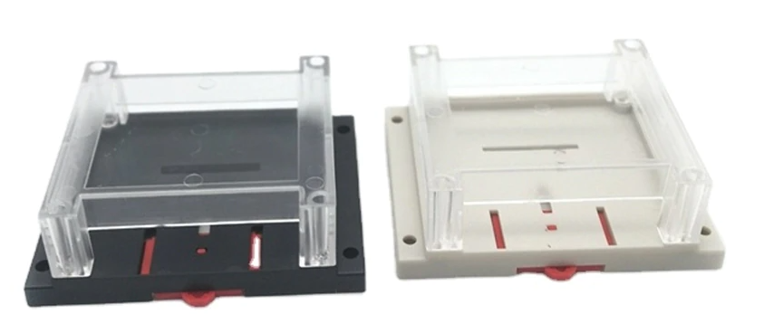

Getting started
===============

Soldering 
----------
.. Important::
    Please note that some components in this board need to be soldered.

If you have never soldered or you want to improve your soldering techniques I recommend you 
the `Adafruit Guide To Excellent Soldering <https://learn.adafruit.com/adafruit-guide-excellent-soldering>`_

For better understanding where is located each component on the board check out the :ref:`pcb` layout 
with the interactive :term:`BOM`.

Powering
--------
The |Product| can be powered in two ways: through the USB-C (only for programming and testing purposes) **or** through the AC Input, but not simultaneously. 

.. Caution::
    Power the board only after making all the connections

AC Power
^^^^^^^^^^^^^
If your preffer not to use external power suplies you can mount the `HLK-2M05 Series <https://www.hlktech.com/en/Goods-39.html>`_, a 2W AC-DC step-down 
switching power supply module, ready to receive the 220V and deliver 5V (later on lowered to 3V3 for the ESP32 module)

.. Danger::
    If your are using the AC power **never touch the board while is powered**. 

Input
-----------
The |Product| supports up to 6 independent *analog inputs* ready to read CT clamps (or probes):

.. _pinout:

.. list-table:: Pinout table
    :widths: 10 20
    :header-rows: 1

    * - GPIO
      - Name
    * - 01
      - Probe 0
    * - 02
      - Probe 1
    * - 03
      - Probe 2
    * - 04
      - Probe 3
    * - 05
      - Probe 4
    * - 06
      - Probe 5

On each channel, there is internally a very simple circuit that adapts the induced voltage on the CT clamp (proportional to the current measured)
and makes the signal ready to be read by the :term:`ADC` of the microcontroller, you can get to know more about the `circuit behind <https://docs.openenergymonitor.org/electricity-monitoring/ct-sensors/interface-with-arduino.html>`_  
in this excelent `guide of electricity monitoring <https://docs.openenergymonitor.org/electricity-monitoring/index.html>`_ 

Communications
-----------
In addition to the analog input mentioned before, there is also a direct connection to:

:term:`IIC` (:math:`I^2C`) bus:
^^^^^^^^
This port is not accessible from external pins, but internally connected to a BMP280 sensor that can offer info about 
environmental temperature & pressure:

:SDA: *GPIO33*
:SCL: *GPIO34*

Serial bus:
^^^^^^^^^^^
:Tx: *TXD0*
:Rx: *RXD0*

Enclosure
---------
The |Product| has been designed to fit in the electronics enclosure LK-PLC01,
compatible with DIN rails and screws, and it is recommended for indoors only.

:External size: 115x90x40mm
:Material: ABS Plastic
:Color: Transparent cover, black or beige base