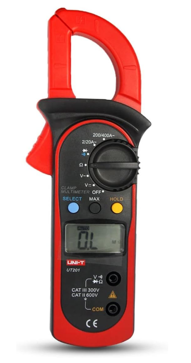
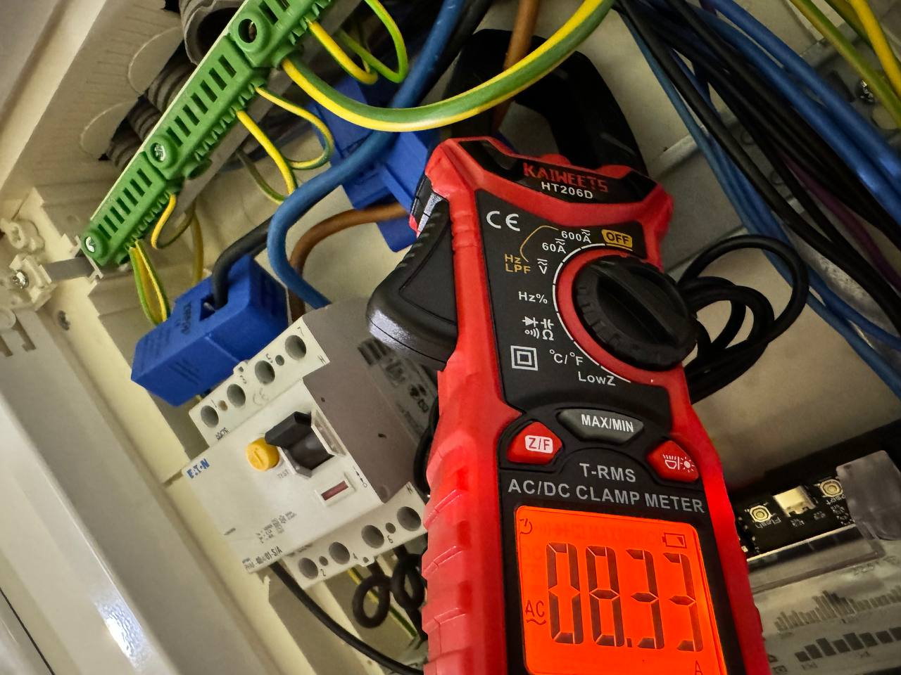
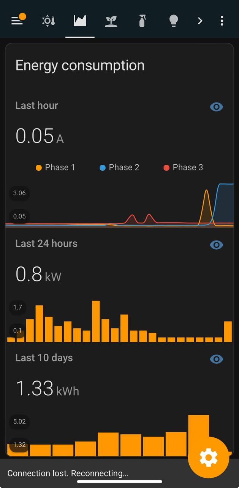
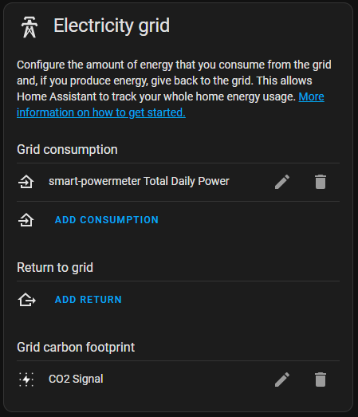
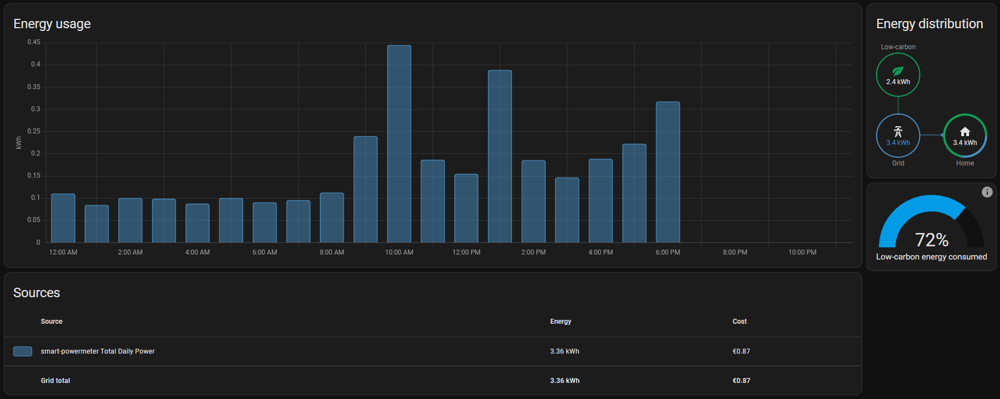

🛠️ Installation
===============

Deployment
-----------

.. Danger::
    The installation of the Smart Powermeter should only be carried by people with **good knowledge about high-voltage electric installations** 
    and familiarized with the procedure that involves installing ct-clamps around main voltages.

After the board has been programmed physically, at least once, it should be ready to receive further updates :term:`OTA`. This means that 
the |Product| can be deployed and installed on it's final place, like an electric cabinet:

1. Locate an empty space on the DIN rail where you can install the enclosed |Product| and mount it.
2. Plug the CT-clamps into the |Product| through the jack connectors.
3. Open the CT-clamps and close them around the power line you want to measure.

.. Caution:: 
  High-voltage cables are very rigid and using too much force for helping claping the instrument 
  around the cables may disconnect them.  

4. Power the |Product| out of any surrounding power lines. **Before connecting anything make sure it is not powered**.

Calibration
------------

    
Although the theoretical value calculated should be good enough for the measurements, I strongly recommend to calibrate each channel with an external handheld ammeter:

In general lines, calibration procedure consists on the basic points:

1. Instrument with an external ammeter the same power line you are measuring with your CT-clamp.
2. Measure at multiple currents, for that turn on different loads consumming differently.

    
3. Apply the coefficients. On ESPHome this is done by entering the multiple measurement points into a filter *calibrate_linear*, like this:

.. parsed-literal::

    filters:
      - calibrate_linear:
          - 0 -> 0
          - 0.042 -> 2.72 # Where 0.042 was the reading from the ESPHome and 2.72 the amps measured with the calibrated instrument

4. Verify that the calibrated measurement matches with what the ammeter displays. Test different loads again.

    
    HA App screencapture of testing loads on the different phases.

Home Assistant setup
--------------------

After the device is installed and calibrated, make sure you add the computed power parameter as part of the grid consumption.

