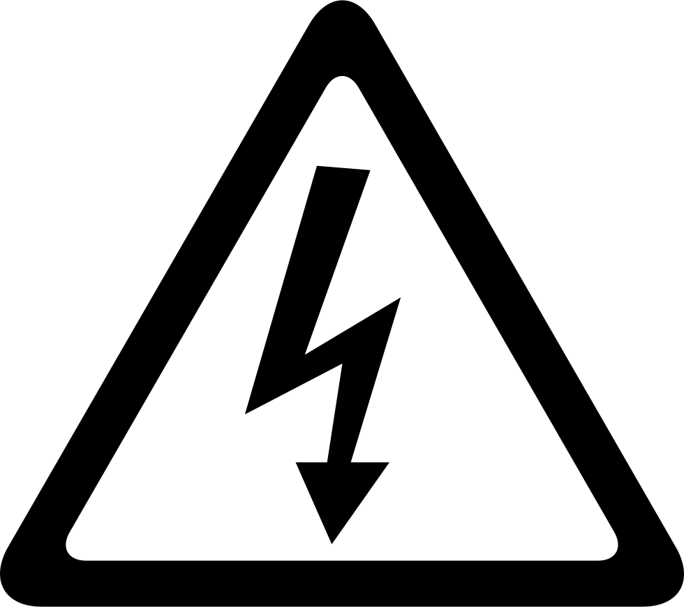
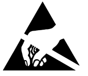
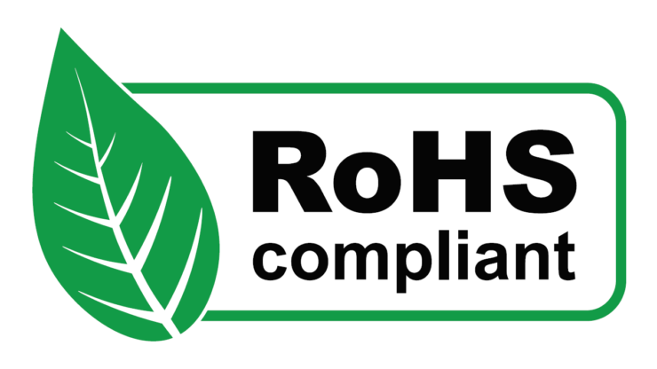

🦺 Safety guidelines
=================

These safety guidelines, the operation instructions and the limit values listed in :doc:`specs` are to be read carefully before operating the product.

.. Caution::
    This product has been designed for being used in domotic applications. 
    It was not designed for any use involving serious risks or hazards that could lead to death, injury, serious physical damage, or loss of any kind without the implementation of exceptionally stringent safety precautions.

 
Risk of electric shock
----------------------

The usage of this product could imply working with high voltage installations (:math:`220-240 V_{AC}`). Perform any action, specially in the area with this symbol on the board, with the appropriate means and always with safety. 

If you have any question, please check with technical support (:ref:`support`) before taking any action potentially dangerous.

Protection against :term:`ESD`
------------------------------

The |Product| contains components sensitive to :term:`ESD`, which can be damaged by inappropriate handling. 
It's therefore necessary to provide some safety precautions against :term:`ESD` during the handling and operation.

Usage, transport and storage
----------------------------

During the use, transport and storage, this product must be protected from any mechanical stress 
(forces applied over the board or it's components), temperatures out of the data-sheet's range, high 
environmental humidity or aggressive atmospheres.

Avoid using it in areas where it cannot be assured the previously mentioned environmental conditions.

Repairs
-------

If any of the components on the board gets damaged, a reparation is possible. This repair can be performed by 
yourself if you identify the problem and have the means for desoldering & soldering. If this is not the case,
just write to the :ref:`support` mail to reach a solution.

Disposal
--------

    
In accordance with national and local environmental protection and material recovery and recycling regulations, 
electronic devices that can no longer be used (in case a repair is not possible) must be disposed of separately 
and not with normal household garbage.

Restriction of Hazardous Substances
-----------------------------------

The :term:`PCB` and the electronic components mounted on the |Product| have been manufactured attending to the EU rules 
restricting the use of hazardous substances (RoHS) in electrical and electronic equipment to protect the 
environment and public health. 

